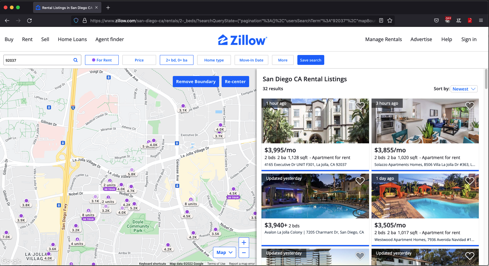

# Zillow Scraper
This script scrapes a Zillow page and dumps all current listed homes to a file. Optionally, it can also send you an email when new homes are posted.

# Installation
## Clone and Install Libs
Clone our repository
```bash
git clone https://github.com/alexliu0809/Zillow_Scraper
```
Install python libraries.
```bash
cd Zillow_Scraper

# Optionally: start a virtual environment
python3 -m venv .
source bin/activate

# Mandatory
python3 -m pip install -r requirements.txt
```

## Find a page to scrape
Find a Zillow page that lists homes to scrape (see below for an example). 


The page listed above has this URL:
```
https://www.zillow.com/san-diego-ca/rentals/2-_beds/?searchQueryState=%7B%22pagination%22%3A%7B%7D%2C%22usersSearchTerm%22%3A%2292037%22%2C%22mapBounds%22%3A%7B%22west%22%3A-117.24590349026118%2C%22east%22%3A-117.1956925375024%2C%22south%22%3A32.85766848585083%2C%22north%22%3A32.88506209326565%7D%2C%22mapZoom%22%3A15%2C%22regionSelection%22%3A%5B%7B%22regionId%22%3A54296%2C%22regionType%22%3A6%7D%5D%2C%22isMapVisible%22%3Atrue%2C%22filterState%22%3A%7B%22beds%22%3A%7B%22min%22%3A2%7D%2C%22fore%22%3A%7B%22value%22%3Afalse%7D%2C%22ah%22%3A%7B%22value%22%3Atrue%7D%2C%22sort%22%3A%7B%22value%22%3A%22days%22%7D%2C%22nc%22%3A%7B%22value%22%3Afalse%7D%2C%22cmsn%22%3A%7B%22value%22%3Afalse%7D%2C%22fsba%22%3A%7B%22value%22%3Afalse%7D%2C%22fr%22%3A%7B%22value%22%3Atrue%7D%2C%22fsbo%22%3A%7B%22value%22%3Afalse%7D%2C%22auc%22%3A%7B%22value%22%3Afalse%7D%7D%2C%22isListVisible%22%3Atrue%7D
```

## Copy The URL to the Script and Overwrite the Default URL
In `zillow_scraper.py`, change the URL placeholder at line 18 to the real URL:
```python
# Replace "YOUR_ZILLOW_URL" with the URL of the page you are interested in:
ZILLOW_URL = r"YOUR_ZILLOW_URL"
```

## Config Email Notification
You can send emails to your own email account when a new home is posted. You need to config three things:
* SENDING_GMAIL_ACCOUNT: a gmail account for sending the notification
* SENDING_GMAIL_PASSWORD: the password for the above gmail account. Note that you might need to create an application specific password for this part to work.
* RECEIVING_EMAIL_ACCOUNT: the email account(s) for receiving the notification. You can have multiple receiving accounts here.

The default setup looks like below in `zillow_scraper.py` (line 19 - 21):
```
SENDING_GMAIL_ACCOUNT = "YOUR_GMAIL_ACCOUNT"
SENDING_GMAIL_PASSWORD = "YOUR_GMAIL_PASSWORD"
RECEIVING_EMAIL_ACCOUNT = ['RECEIVING_EMAIL_ACCOUNT',]
```

You need to replace the placeholders with real email accounts and passwords. An example configuration:
```
SENDING_GMAIL_ACCOUNT = "alex@gmail.com"
SENDING_GMAIL_PASSWORD = "alexpassword"
RECEIVING_EMAIL_ACCOUNT = ['bob@gmail.com',"charlie@outlook.com"]
```

## Run the script
One way to run the script (this run the script every 2 hours)
```
screen -S scrap; # optionally create a screen session
while true; do python3 zillow_scraper.py; sleep 7200; done # Run the script every 7200 seconds
```

# Disclaimer
This script is not designed for large-scale scraping. Use it at your own risk.